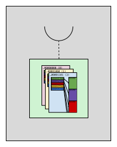
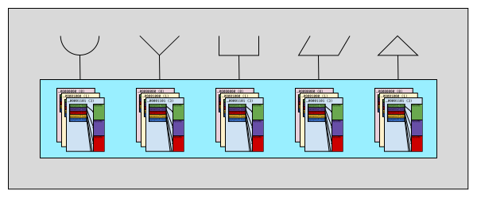
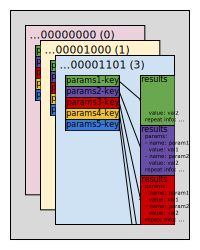
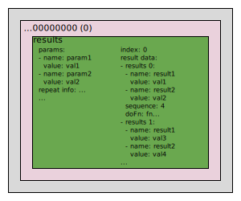
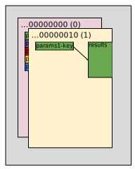

# Anatomy of a Lock-free Mock

Understanding the inner workings of a mock is not the highest priority for most developers. But since these mocks are quite a bit different internally, some extra details of the internals won't hurt.

Before we begin zooming into the inner workings, to make the journey complete, we first need to zoom out one step &mdash; to first take a look at the whole scene. [As described in the top-level docs](../../README.md#working-with-multiple-mocks):
> A `Scene` is a collection of mocks, and it allows you to perform actions on all the mocks with a single call.

So our first diagram is the big picture. We see several mocks all working together in the context of a test. The test can use the `Scene` to manipulate all of mocks at once.


Now focusing on just a few mocks and the code generated for them, we notice that they all have similar in-memory structures. Both functions and full interfaces can be mocked. When a function is mocked, there's still a mock object to maintain state. But a function mock only mocks a single function and that function is attached to the mock object by a closure created by the `mock` method (indicated here by the dashed line):



A mock of an interface mocks several methods at once &mdash; all methods of the interface to meet the contract of the interface. Note that the structures for each method are independent. Again, the `mock` method returns the implementation, but for an interface mock, `mock` returns an implementation of the whole interface.



Note that both of the above diagrams simplify the interface to the rest of the system. The code that actually gets generated can be broken down into two categories:
1. __The mock interface__: This interface is an exact implementation of the interface or function type as required by the code that accepts that interface or function type.
2. __The recorder interface__: This interface is used to store expectations, and it has some similarities to the mock interface. For instance, you can use the recorder interface to tell the mock what to return when called with a specific set of parameters.

### Any parameters
As mentioned above, the structures for each method in an interface are independent from each other as are the structures for a function type mock. The first method-specific data is a slice of structures that differentiate calls with "any" parameters. "Any" parameters indicate that a specific parameter should be ignored when matching _actual_ function calls to _expected_ function calls. This top-level slice contains a structure for each combination of "any" parameters and real parameters as defined by the test. For example, if a function defines two parameters and a test expects some calls with both parameters defined and some calls with "any" first parameter, there will be two structures in this top-level slice. The slice is ordered with the most specific expectations (least "any" parameters) first.

Each of the top-level "any" structures contains a `uint64` bitmask and a count of "any" parameters. The bitmask indicates which parameters are "any" parameters. The count is used to keep the top-level slice sorted.



### Mapping parameters to results
The next structure is a hashmap that maps a specific set of parameters to a results structure. The key of this hashmap (how things are found in the hashmap) is a structure containing a representation of each parameter. This is the parameter key `struct`. It typically is capable of holding two representations of each parameter (although only one value is actually set per parameter):
1. The parameter value itself.
2. A deep hash of the parameter.

In Go, a `struct` can be used as a map key if it is of fixed length. The value (#1 in the above list) is omitted from the generated code if the parameter value has a variable size (a slice for instance). If Moqueries didn't omit the parameter value, the map definition and the mock wouldn't compile. Therefore, variable length parameters (such as slices) can only be represented by a deep hash (`ParamIndexByHash`).

Here's a typical looking parameter key `struct` where all the parameters can be represented by their value or by their deep hash:
```go
type moqStore_LightGadgetsByWidgetId_paramsKey struct {
	params struct {
		widgetId  int
		maxWeight uint32
	}
	hashes struct {
		widgetId  hash.Hash
		maxWeight hash.Hash
	}
}
```

Here is the parameter key `struct` for the `Write` function of the mock to the `io.Writer` interface (the `byte` slice `p` can only be represented by a deep hash):
```go
type moqWriter_Write_paramsKey struct {
	params struct{}
	hashes struct{ p hash.Hash }
}
```

Which value is set (the value or the deep hash) is determined for each parameter by the `runtime` configuration. Each parameter is given a value of `ParamIndexByValue` for value matching or a value of `ParamIndexByHash` for deep hash matching. The runtime configuration shouldn't be altered after setting any expectations or the expectations may not be found.

If a parameter is an "any" parameter, the zero value (or zero value hash) is stored in the parameter key.


### Results
The results structure stores all the result information for a given set of parameters. The first thing we see in this structure is another copy of the parameters &mdash; these parameters are complete though; there are no hashes substituted. The parameters are used when reporting errors.



Next in the results structure is a simple index. This index is an integer that is updated with Go's `sync/atomic` package. This allows multiple Go routines to update the results as each routine will increment and receive a different index value.

Finally, a slice of result values fills out the rest of the results structure. These values are actually returned to any callers. Along with the result values, the expected sequence value and any "do" functions are stored (both optional). More details on sequences follow below. "Do" functions allow a test to define side effects or store information for given calls.

## Storing expectations
Now that we see the basic structure, the next step is to store some expectations so that our mocks can start interacting with the code being tested. Note that a mock is thread-safe and reentrant via its mock interface only and only after expectations are set. Expectations should only be set via single-threaded test setup code.

Each mock has a generated DSL for assembling expectations. Details gathered via the DSL include:
1. Parameters
2. Which parameters are "any" parameters
3. Whether a sequence should be checked
4. How many times the function might be called (min, max, etc.)
5. What the result values for each call will be

Here is one of the more complex expectations from the main readme:
```go
storeMoq.onCall().LightGadgetsByWidgetId(0, 10).any().widgetId().
	returnResults([]demo.Gadget{g3, g4}, nil).repeat(moq.Times(5)).
	returnResults(nil, errors.New("too much")).repeat(moq.AnyTimes())
```

Translated into English, the expectation from running the test is that `LightGadgetsByWidgetId` will be called with any `widgetId` (the first parameter; note the zero value is ignored) and a `maxWeight` of `10` (the second parameter). The result values for the first five calls will be `[]demo.Gadget{g3, g4}` and `nil`. Any number of calls can be made and all calls after the first five calls will return `nil` and a "too much" error. We will use this example repeatedly throughout the rest of the guide.

Note that remainder of this "Storing expectations" section describes what the generated code does for you. All you have to do is set expectations in a test similar to the Go code above.

### Storing any parameters
The first step in storing expectations is to calculate the "any" parameters bitmask and count how many bits are set (or how many parameters are "any"). In the above example expectation, the first parameter is an "any" and the second is not resulting in a `0b01` bitmask and a bit count of `1`. Then the top-level slice (described [above](#any-parameters)) is scanned for any entry with the same bitmask. If one isn't found, a new entry is created positioned so that the entries are in order of increasing bit counts.


### Building a parameter key
Next up in the process of storing expectation is to create an entry in the parameter-to-results map [mentioned above](#mapping-parameters-to-results). And as mentioned above, the key to this map is a structure containing a copy or a deep hash of each parameter (or the zero value if representing an "any" parameter). Going back to the example expectation, the map key structure looks like the following (here the `widgetId` has a zero value and `maxWeight` is represented as a hash):
```go
paramsKey := moqStore_LightGadgetsByWidgetId_paramsKey{
    params: struct {
        widgetId  int
        maxWeight uint32
    }{
        widgetId: 0,
    },
    hashes: struct {
        widgetId  hash.Hash
        maxWeight hash.Hash
    }{
        maxWeight: 0xf7431a2832fec7a8,
    },
}
```

Note that the first parameter will always be represented by a zero value because it is an "any" parameter (even if a real value was supplied, it is ignored). The second value is not specified in the `params` section but does have a hash in the `hashes` section. Deep hashes are represented by the `moqueries.org/cli/hash.Hash` type (which is just a `uint64`).

### Storing results
The last step in storing expectations is building the results structure. As [mentioned above](#results), this includes the parameters, repeat information, a results index (initialized to `0`), and a slice of result values. Over the course of setting multiple expectations, the same parameters used for the same mock function call can "grow" the results structure. When all expectations are set, the slice of result values will contain an entry for each expected invocation (up to the defined max) plus one set of result values if repeating with the `AnyTimes` function.
```go
type moqStore_LightGadgetsByWidgetId_results struct {
	params  moqStore_LightGadgetsByWidgetId_params
	results []struct {
		values *struct {
			result1 []demo.Gadget
			result2 error
		}
		...
	}
	index  uint32
	repeat *moq.RepeatVal
}

resultsByParams[paramsKey] = &moqStore_LightGadgetsByWidgetId_results{
	params:  moqStore_LightGadgetsByWidgetId_params{
		widgetId:  0,
		maxWeight: 10,
	},
	results: nil,
	index:   0,
	repeat:  &moq.RepeatVal{
		MinTimes:    5,
		MaxTimes:    5,
		AnyTimes:    true,
		...
	},
}
```

The inner `results` slice contains a copy of the result values for each invocation plus a set of result values for any additional calls (the `AnyTimes` result values):
```go
results := {
	{
		values: {
			result1: []demo.Gadget{g3, g4},
			result2: nil,
        },
		...
    },
	{
		values: {
			result1: []demo.Gadget{g3, g4},
			result2: nil,
		},
		...
	},
	...
	// Here are the `AnyTimes` results that will be returned repeatedly
	{
		values: {
			result1: nil,
			result2: errors.New("too much"),
		},
		...
	},
}
```



### Expecting call sequences
Each expectation can require that it be called in a specific order or sequence of calls. Each mock has is a default sequence configuration which indicates that all expectations will be sequenced or no expectations will be sequenced. Each individual expectation can override the default by calling either `seq` (when the default is no sequences) or `noSeq` (when the default is all sequences). As each expectation is set (potentially repeatedly set when `repeat` is used), the next expected sequence value is retrieved from the scene and stored with the result values (not shown in the above code samples).

### Do functions
"Do" functions allow side effects to be defined for each expectation. There are two types of "do" function defined for each method: 1) simple "do" functions take all parameters (intended to just pass the parameters back to the test) and 2) "do return" functions that take all parameters and return results that will be passed back to the code being tested. Multiple expectations can set either type of "do" function to the same function or different functions can be defined for each result.

## Interacting with the mock
Now that all the expectations are set, it's time to have the mock interact with some actual production code. The generated code has created a `mock` function that returns that either implements the given interface (for interface mocks) or the given function type (for function type mocks). Again some code from the main readme:
```go
d := demo.FavWriter{
    IsFav: isFavMoq.mock(),
    W:     writerMoq.mock(),
}
```

In this case, the code being tested (`FavWriter`) takes an `IsFav` function that implements a `func(n int) bool` signature and a `W` object that implements the `io.Writer` interface.

### Finding results with any parameters
Finally, a method is getting invoked on a mock! The first thing the generated code needs to navigate through is the "any" structures contained in the top-level slice [mentioned above](#any-parameters). This slice is already in the order of most specific (fewest "any" parameters) to least specific (most "any" parameters). As we iterate through the "any" structures, we have to build a parameter key specific to the given "any" structure (with zero values for parameters flagged as "any"). The bitmask in the "any" structure determines which parameters will go into the key and which parameters will stay zero values. If a map entry is found, it will contain the results needed and there is no need to continue iterating through the top-level slice.

### Nice vs. strict
So now we should have some results, right? Maybe not! If we didn't find any results and the mock is "nice", we just return some zero values. On the other hand, a "strict" mock will fail the test. Game over!

That was a fun paragraph! Must have dialed in the caffeine on this fine afternoon! If anyone would like to rewrite all of this documentation in the same tone, I would love to accept your PR!

### Which result
Now we've found the result structure [described above](#results) (assuming we didn't just return zero values). The first "write" operation we do is increment the index (again using Go's `sync/atomic` package). If the resulting value is larger than slice of result values and the expectation wasn't flagged as `AnyTimes` (and we are using a "strict" mock), the test fails. There's a lot to unwind in that last sentence so here goes: 1) if it's a "nice" mock, the mock returns zero values, 2) if the expectation is `AnyTimes`, the mock uses the last result values, or 3) if the index is within bounds of the result values slice, the mock uses the specified result values.

### Validating sequences
As each result is found, if the result defines an expected sequence number, the next sequence number is retrieved from the `Scene` (via `NextMockSequence`). If the expected sequence doesn't match the scene's next sequence, the test fails.

<a name="validating-sequences-disclaimer">**__DISCLAIMER__**:</a> You may be wondering how incrementing two atomic integers (one for the results index and another for the sequence) can be internally consistent. The answer is they aren't. Sorry! Don't use sequences in this manner. We have thought of this. There's even [a test](../../generator/testmoqs/atomic_test.go) showing the inconsistency.

### Invoking do functions
At this stage, all the mock needs to do is invoke any "do" function defined in the results (note that "do" functions are optional so we may just return the [supplied values](#storing-results)). One obvious word of caution &mdash; if your test runs multiple Go routines, make sure your "do" functions are thread-safe and reentrant. Simple "do" functions are passed all parameters. "Do return" functions are passed all parameters and return the result values that the mock will return to the code being tested &mdash; "do return" functions actually set the return values of the mock. If both result values and a "do return" function are defined, the "do return" function takes precedence.

### Asserting all expectations are met
As a test is completing, it's common to do some additional validation. You can assert that all required expectations were called via the `AssertExpectationsMet` method. This can be called on each individual mock or for the entire `Scene` (the `Scene` simply iterates through its list of mocks and calls the method for each mock).
